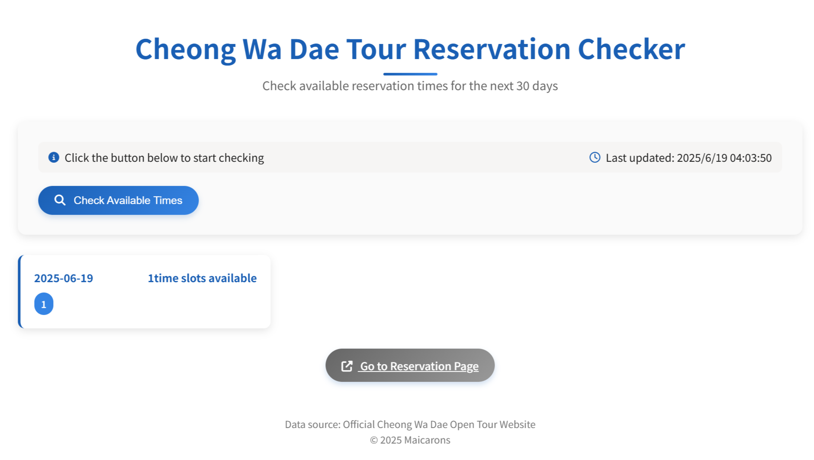

# Cheong Wa Dae Tour Reservation Checker

A multilingual web application for checking available reservation times for Cheong Wa Dae (Blue House) tours in South Korea.



## Features ✨

- **Multilingual Support**: English, Korean, and Chinese interfaces
- **Real-time Availability Check**: Scans next 30 days for open slots
- **User-Friendly Interface**: Clean, responsive design with intuitive controls
- **Quick Reservation Access**: Direct link to official reservation page when slots are available
- **Persistent Preferences**: Remembers your language choice between visits

## How to Use 🚀

1. **Access the Tool**:
   - Live Demo: <https://maicarons.github.io/CheongWaDaeChecker/>
   - Or visit <https://cheongwadaechecker.maicarons.cc/>
   - Or clone this repository and open [`public/index.html`](public/index.html) in your browser

2. **Check Availability**:
   - Click the "Check Available Times" button
   - Wait for the scan to complete (typically takes 10-20 seconds)

3. **Make Reservation**:
   - If slots are available, click "Go to Reservation Page"
   - Complete your booking on the official Cheong Wa Dae website

## Language Support 🌐

| Language  | Button | Status |
|-----------|--------|--------|
| English   | ✅     | ✅     |
| 한국어    | ✅     | ✅     |
| 中文      | ✅     | ✅     |

## Technical Details ⚙️

- **Frontend**: Pure HTML/CSS/JavaScript (no frameworks)
- **i18n Implementation**: Custom lightweight translation system
- **API**: Direct calls to Cheong Wa Dae's public reservation interface
- **Compatibility**: Works on all modern browsers

## Known Limitations ⚠️

- Due to browser CORS restrictions, you may need to:
  - Use the live demo version, or
  - Run a local server (e.g., ```bash
    python -m http.server
    ```), or
  - Configure your browser to allow cross-origin requests for API access

## Contributing 🤝

Contributions are welcome! Please open an issue or pull request for:
- Additional language translations
- UI/UX improvements
- Bug fixes

## License 📄

This project is licensed under the GPLv3.0 License - see the [LICENSE](LICENSE) file for details.

---


**Created by Maicarons**
